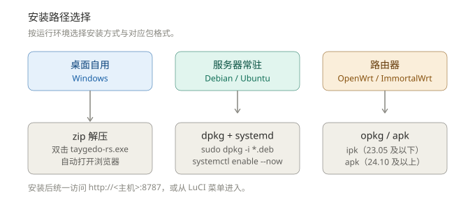
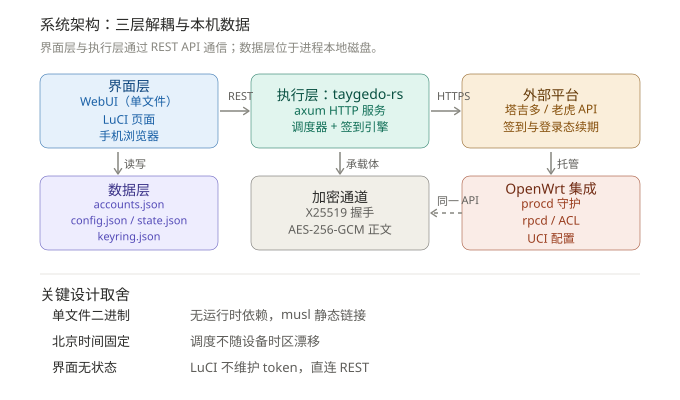
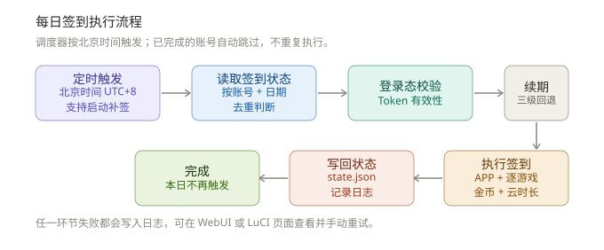
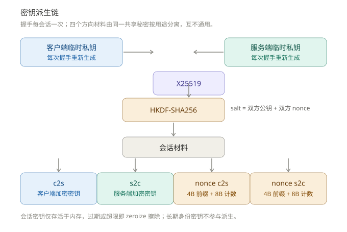
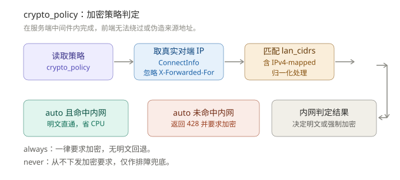
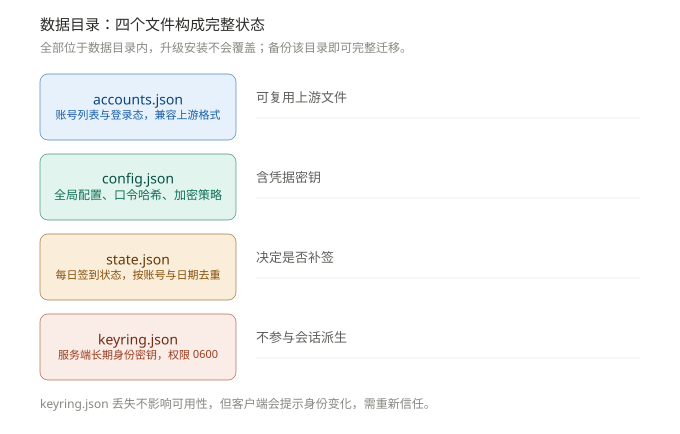
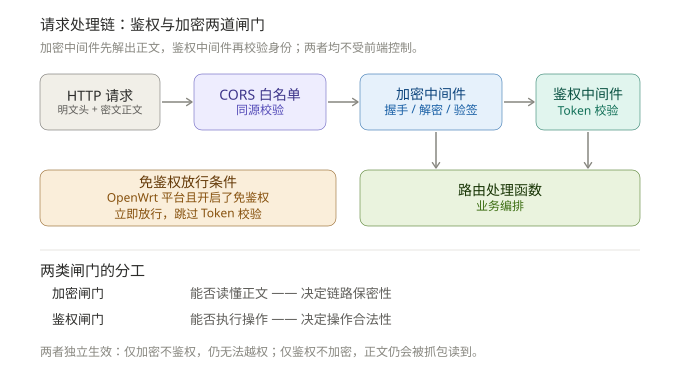
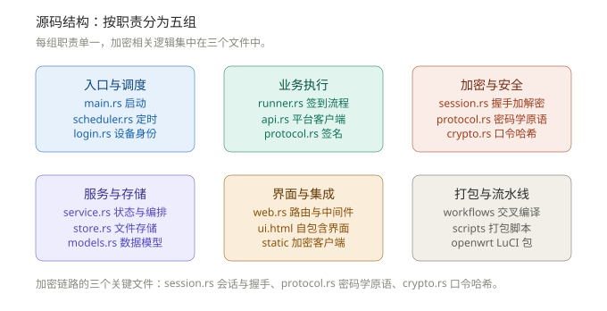

<div align="center">

# 塔吉多自动签到 (Rust 版)

基于 Rust 重写的塔吉多（幻塔 / 异环等）每日全自动签到工具，主打**简单易用、零门槛运行**。

[](https://www.rust-lang.org/)
[](./LICENSE)
[](#安装教程)
[-green?style=flat-square)](#应用层加密)
[](https://github.com/LianXia233/taygedo-CI/releases)

<p align="center">
  下载单文件、双击即启，全部操作在现代化、带登录鉴权、自适应的 WebUI 中完成。<br>
  深度适配 <b>OpenWrt 主线与原生 LuCI</b>，内置端到端应用层加密通道。
</p>

</div>

---

> [!TIP]
> **应用层端到端加密保障**  
> WebUI / LuCI 与后端之间的请求与响应正文传输采用 **X25519 + HKDF-SHA256 + AES-256-GCM** 应用层加密通道。即使在公共网络、镜像端口或共享 Wi-Fi 下被动抓包，攻击者也无法窃取登录口令、Token 与账号隐私数据。详见 [应用层加密](#应用层加密)。

> [!NOTE]
> **版本发布轨道**  
> - **正式版**（如 `v0.4.11`、`v0.5.0`）：稳定，推荐生产环境使用。访问 [Latest Release](https://github.com/LianXia233/taygedo-CI/releases/latest)。  
> - **`nightly` 版**：滚动预发布，每次手动触发构建后覆盖更新，供快速尝鲜。  
> 
> 📦 各平台安装包见 [Releases](https://github.com/LianXia233/taygedo-CI/releases)。上游逻辑参考 [zzstar101/taygedo-auto-attendance](https://github.com/zzstar101/taygedo-auto-attendance)（TypeScript 版，MIT 许可）。本项目自身代码以 **GPL-3.0** 发布，详见 [许可证](#许可证)。

---

## 三步上手（零门槛）

全程通过浏览器完成：添加账号、设置签到时间、查看审计日志与全局配置均在 Web 界面搞定。

<div align="center">
  
  <p><sub>图 1：按运行环境选择安装方式与包格式</sub></p>
</div>

| 步骤 | Windows | Debian / Ubuntu | OpenWrt (软路由 / 硬件路由) |
| :---: | :--- | :--- | :--- |
| **① 下载** | 到 [Releases](https://github.com/LianXia233/taygedo-CI/releases) 下载 zip 并解压 | 下载对应架构的 `.deb` 包 | 下载对应架构的 `.ipk` 或 `.apk` |
| **② 运行** | **双击 `taygedo-rs.exe`**<br>*(自动唤起默认浏览器)* | `sudo dpkg -i taygedo-rs_*.deb`<br>`sudo systemctl enable --now taygedo-rs` | `opkg install` 或 `apk add`<br>*(安装完成后自动注册服务并启动)* |
| **③ 使用** | 浏览器打开 `http://127.0.0.1:8787`，用**首次启动生成的随机初始口令**登录 | 浏览器打开 `http://<服务器IP>:8787`，输入 `journalctl` 打印的口令登录 | 进入 LuCI 菜单：**服务 → 塔吉多签到**<br>*(默认开启内网免密直连)* |

> [!IMPORTANT]
> **关键安全须知**
> - **初始随机口令**：从 `0.5.0` 起彻底弃用固定 `admin/admin`。首次启动会自动生成高强度随机口令，**仅在启动横幅（控制台 / 系统日志）中打印一次**，登录后请立即在「设置」中修改。
> - **智能自适应加密**：加密默认开启（`crypto_policy=auto`）。局域网访问明文直通以节省嵌入式 CPU 算力，一旦请求来源脱离内网白名单便自动强制端到端加密，无需繁琐配置。

---

## 功能特性

<div align="center">
  
  <p><sub>图 2：系统架构（界面层与执行层通过 REST API 交互，本地状态独占落盘）</sub></p>
</div>

### 易用与交互
- **开箱即用，零门槛**：单文件绿色分发，双击解压即用；所有操作集成于 Web 界面，无需配置复杂命令行参数。
- **响应式现代化 UI**：自适应手机与 PC 视口，支持深浅色主题切换、精美毛玻璃背景卡片。
- **实时日志看板**：WebUI 实时输出带毫秒级时间戳的详细流水审计日志。

### 账号与多模式登录
- **多账号管理**：支持录入任意数量的游戏账号，独立调度、互相隔离。
- **双模态认证**：
  - **密码登录**：密码在本地经由 `scrypt + AES-256-GCM` 加密落盘，向下兼容上游数据格式。
  - **短信验证码登录**：WebUI 支持一键下发短信验证码，快速免密授权。

### 自动化调度与执行
- **精确时区调度**：独立调度器严格锁死**北京时间（UTC+8）**运行，消除宿主机时区影响；跨平台（Windows / Linux / OpenWrt）触发时刻完全一致。
- **开机与断网自动补签**：若设定时刻机器处于关机或离线状态，进程启动后自动完成当天**补签**；单账号单日严格触发一次，已签到自动跳过。
- **全任务签到链路**：APP 每日签到、逐游戏打卡（幻塔 1256、异环 1289 等，呈现中文游戏名）、金币任务（打卡/浏览/点赞/分享）、云异环时长托管。
- **幽灵角色阻断机制**：优先以 `getGameRecordCards` 战绩卡构建角色与游戏映射，避免 `getGameRoles` 偶发返回幽灵角色触发整账号 `code=5050` 报错。
- **高可用会话自动续期**：`accessToken` 失效 $\rightarrow$ 自动调用 `refreshToken` $\rightarrow$ 失败再经由 `laohuToken` 重建会话 $\rightarrow$ 仍失败则通过加密凭据静默重登。

### 安全防护与加固
- **双重认证鉴权**：API 访问受 Token 鉴权保护（7 天有效期）。口令哈希使用 **scrypt（N=16384, r=8, p=1）+ 恒定时间比对**（旧 `sha256` 单轮哈希首次登录自动原地升级）。修改密码后已签发 Token 瞬间全部吊销，登录接口内置失败速率限制（HTTP 429）。
- **内网免鉴权模式（可选）**：通过环境变量 `TAYGEDO_NO_AUTH=1` 或 OpenWrt UCI `option no_auth '1'`（默认已开）启用，内网环境直接免密控制。非内网来源严格阻断放行。
- **应用层端到端加密**：全链路采用 **X25519 临时密钥交换 + HKDF-SHA256 + AES-256-GCM**，提供前向保密、单调递增 Nonce 防重放与 AAD 上下文绑定。实测嗅探环境下账号密码与 Token 暴露频次为 **0 次**。

---

## 界面展示

<div align="center">
  
  <p><sub>图 3：WebUI 主界面预览（看板统计、账号卡片与实时运行日志）</sub></p>
</div>

访问 `http://<host>:8787`，使用启动日志输出的随机初始口令登录：

- **看板概览**：顶部展示账号总数、今日已完成与排队待签到统计。
- **账号卡片**：展示专属头像、平台昵称（无昵称回退备注），支持单独定制执行时刻，提供「立即签到」与「删除」。
- **凭据录入**：支持账号密码与短信验证码双向快捷绑定。
- **全局控制面板**：配置默认执行时间、金币打卡任务、云游戏时长、分享平台、管理密码变更及安全退出。
- **日志审计流**：右侧内置高刷新率实时运行终端。

---

## 安装教程

### 平台包格式速查

| 平台环境 | 文件名格式 | 架构 / 说明 |
| :--- | :--- | :--- |
| **Windows (64 位)** | `taygedo-rs-windows-x86_64.zip` | 绿色解压即用单文件程序 |
| **Debian / Ubuntu (amd64)** | `taygedo-rs_<版本>_amd64.deb` | 集成 systemd 服务与开机自启 |
| **OpenWrt (x86_64 软路由)** | `luci-app-taygedo_<版本>-1_x86_64.[ipk/apk]` | 包含完整 LuCI 前端与后端守护 |
| **OpenWrt (ARM64 路由)** | `luci-app-taygedo_<版本>-1_aarch64_cortex-a53.[ipk/apk]` | 适配 MT7986、Rockchip 等嵌入式平台 |
| **Linux 通用 (musl)** | `taygedo-rs-<arch>-unknown-linux-musl.tar.gz` | 静态编译，适合容器及轻量发行版 |

> [!NOTE]
> OpenWrt **24.10 及以上**版本采用 `apk` 包管理器；OpenWrt **23.05 及以下**版本使用 `opkg` (`ipk`)。

---

### Windows 安装

1. **下载解压**  
   在 [Releases](https://github.com/LianXia233/taygedo-CI/releases) 下载 `taygedo-rs-windows-x86_64.zip` 并解压得到 `taygedo-rs.exe`。

2. **启动运行**  
   - **方式一（快捷）**：直接双击 `taygedo-rs.exe`，启动后台服务并自动弹出浏览器。  
   - **方式二（命令行推荐）**：打开 PowerShell 便于传参或观察启动输出：
     ```powershell
     # 启动服务
     .\taygedo-rs.exe

     # 可选：自定义环境变量
     $env:TAYGEDO_LISTEN = "0.0.0.0:8787"        # 自定义监听端口（默认 8787）
     $env:TAYGEDO_DATA_DIR = "D:\taygedo-data"   # 自定义数据存储目录（默认 .\data）
     $env:TAYGEDO_WEB_PASSWORD = "YourPassword"  # 可选：显式指定初始管理密码
     .\taygedo-rs.exe
     ```

3. **进入管理页面**  
   浏览器访问 `http://127.0.0.1:8787`，输入控制台打印的初始口令登录。

4. **开机自启（可选）**  
   - 快捷方式放入自启目录：按 `Win + R` 输入 `shell:startup`，将 `taygedo-rs.exe` 的快捷方式粘贴进去。  
   - 或使用「任务计划程序」创建登录触发的高权限任务。

5. **局域网访问放行（可选）**  
   ```powershell
   netsh advfirewall firewall add rule name="taygedo" dir=in action=allow protocol=TCP localport=8787
   ```

---

### Debian / Ubuntu 安装

1. **安装软件包**  
   ```bash
   sudo dpkg -i taygedo-rs_<版本>_amd64.deb
   sudo apt-get install -f    # 补全依赖（通常为零依赖）
   ```

2. **启动并激活开机自启**  
   ```bash
   sudo systemctl enable --now taygedo-rs
   sudo systemctl status taygedo-rs
   ```

3. **自定义环境变量（可选）**  
   ```bash
   sudo systemctl edit taygedo-rs
   ```
   在编辑界面中填入以下内容并保存退出：
   ```ini
   [Service]
   Environment=TAYGEDO_LISTEN=0.0.0.0:8787
   Environment=TAYGEDO_DATA_DIR=/var/lib/taygedo
   Environment=TAYGEDO_WEB_PASSWORD=YourPassword
   ```
   应用生效：
   ```bash
   sudo systemctl daemon-reload
   sudo systemctl restart taygedo-rs
   ```

4. **获取口令与审计日志**  
   从 systemd 日志中提取首次启动生成的随机口令：
   ```bash
   sudo journalctl -u taygedo-rs -f
   ```
   数据默认持久化至 `/var/lib/taygedo`。

---

### OpenWrt 安装与 LuCI 配置

1. **安装对应的架构包**  
   ```sh
   # opkg 安装（OpenWrt 23.05 及更早版本）
   opkg install /tmp/luci-app-taygedo_<版本>-1_x86_64.ipk

   # apk 安装（OpenWrt 24.10 及更新版本）
   apk add /tmp/luci-app-taygedo_<版本>-r1_x86_64.apk
   ```

2. **开箱即用状态**  
   安装脚本自动完成注册并拉起服务，`/etc/config/taygedo` 默认注入 `enabled '1'` 与 `no_auth '1'`。直接打开路由器管理界面：**服务 → 塔吉多签到** 即可直连控制面板。

3. **免鉴权模式特性**  
   - **已开启免鉴权（默认）**：局域网访问 LuCI 直接免密联动后端 API。
   - **未开免鉴权**：LuCI 提示认证引导卡片，点击右上角「外部 WebUI」跳转至 `:8787` 输入随机口令登录。
   - **解耦机制**：UCI（`/etc/config/taygedo`）专注服务级控制（启停/端口/网段）；业务配置（签到时刻/任务开关）由 `config.json` 托管，重启服务互不覆盖。

   | 维度 | 说明 |
   | :--- | :--- |
   | **生效边界** | 仅作用于 `/api/*` REST 接口，**不改变 LuCI 原生系统的认证机制与 ACL** |
   | **放行约束** | 需同时满足 `no_auth=1` 且请求 IP 命中 `lan_cidrs` 白名单；公网流量严格拒绝 |
   | **网络安全** | 仅建议在受信任局域网启用；若直接暴露公网映射，请置为 `no_auth=0` |
   | **加密隔离** | 与 `crypto_policy` 独立互不干扰，非受信任网段自动强制密文传输 |

4. **UCI 控制命令参考**  
   ```sh
   # 切换免鉴权模式
   uci set taygedo.main.no_auth=1 && uci commit taygedo && /etc/init.d/taygedo restart

   # 修改监听端口
   uci set taygedo.main.port=8787 && uci commit taygedo && /etc/init.d/taygedo restart

   # 查看运行日志与提取初始随机口令
   /etc/init.d/taygedo status
   logread | grep taygedo
   ```

---

## 通用使用指南

<div align="center">
  
  <p><sub>图 4：每日定时签到执行流程时序</sub></p>
</div>

- **控制台登录**：0.5.0 起首次生成随机口令（控制台仅输出一次），登录后务必在「设置」中修改口令（长度 $\ge$ 8），成功后原所有 Token 立即作废。
- **绑定账号**：在「添加账号」弹窗中，根据需求选择账号密码认证或短信验证码直登。
- **设置时刻**：可在「全局设置」指定统一打卡时刻，亦可在各账号卡片上单独定制差异化执行时间。
- **手动触发**：点击卡片上的「立即签到」可随时手动拉起全流程任务。
- **多账号轮询**：重复添加流程即可，多账号互不干扰、独立保存登录凭据与执行状态。

---

## 从源码构建

### Docker 容器化构建（推荐）

```bash
docker compose up -d --build
```
启动后访问 `http://localhost:8787`，所有数据自动持久化于 `./data`。

### Cargo 本机编译

需要已安装稳定版 Rust 工具链（Stable）：

```bash
cargo run --release
```

**支持的环境变量配置**：

| 环境变量 | 默认值 | 功能说明 |
| :--- | :--- | :--- |
| `TAYGEDO_LISTEN` | `0.0.0.0:8787` | HTTP 监听地址与绑定端口 |
| `TAYGEDO_DATA_DIR` | `data` | 数据持久化存放目录 |
| `TAYGEDO_WEB_PASSWORD` | 无 | 显式指定初始管理密码（未配置则使用 CSPRNG 动态生成，仅首次初始化有效） |
| `TAYGEDO_DEFAULT_SCHEDULE` | 无 | 覆盖全局默认签到时刻（格式：`HH:MM`） |
| `TAYGEDO_COIN_TASKS` | 无 | 覆盖金币打卡任务开关（`true` / `false`） |
| `TAYGEDO_CLOUD_DURATION` | 无 | 覆盖云异环时长开关（`true` / `false`） |
| `TAYGEDO_SHARE_PLATFORM` | 无 | 覆盖分享渠道标记 |
| `TAYGEDO_NO_AUTH` | `false` | 免登录模式开关（`1/true/yes/on` 启用） |

### Windows 交叉编译

```bash
rustup toolchain install stable-x86_64-pc-windows-gnu
cargo +stable-x86_64-pc-windows-gnu build --release
```

---

## 多平台 / 多架构支持

底层采用 musl 全静态链接构建，由 GitHub Actions 交叉编译自动化发布：

| OpenWrt 架构目标 | Rust Target Triple | 典型适用设备 |
| :--- | :--- | :--- |
| **x86_64** | `x86_64-unknown-linux-musl` | 常见 PC 软路由、工控机、PVE/ESXi 虚拟机 |
| **aarch64 (cortex-a53)** | `aarch64-unknown-linux-musl` | MediaTek MT7986、Rockchip RK3568/RK3588 等现代路由器 |

---

## OpenWrt / LuCI 集成（开发者）

`openwrt/luci-app-taygedo/` 提供了规范的 LuCI 扩展工程：

- **体验完全对齐**：原生 JavaScript 视图层与独立 WebUI 功能高度一致。
- **服务分层解耦**：LuCI 页面基于 RESTful API 直连交互；UCI 仅维护进程级状态。
- **进程生命周期管理**：结合 `procd` 体系实现崩溃拉起、热加载与守护。

```
openwrt/luci-app-taygedo/
├── Makefile                        # 编译与打包控制定义
├── htdocs/
│   └── luci-static/resources/view/taygedo/
│       └── status.js               # 现代化 LuCI JS 前端
└── root/
    ├── etc/config/taygedo          # UCI 默认配置文件
    ├── etc/init.d/taygedo          # procd 守护脚本
    └── usr/share/
        ├── luci/menu.d/taygedo.json
        └── rpcd/acl.d/luci-app-taygedo.json
```

编译方法：将该目录置于 OpenWrt 源码树的 `package/` 或 自定义 feeds 中，执行 `make menuconfig` 勾选 `LuCI → Applications → luci-app-taygedo` 后编译。

---

## 应用层加密

**加密边界收敛于「浏览器客户端」与「后端服务」之间：两端维护明文，中间传输链路全量混淆。**

<div align="center">
  
  <p><sub>图 5：应用层端到端加密原理图（加密边界与会话派生链路）</sub></p>
</div>

> [!NOTE]
> 本机制非 TLS/HTTPS 替代品，而是构建于标准 HTTP 之上的应用层正文混淆增强：HTTP 请求头保持明文，**请求与响应正文彻底密文传输**。在难以配置可信证书的局域网或自编译路由场景下，提供等价的安全兜底防线。

### 威胁模型与防护边界

- **防护目标**：抵御在局域网内或公网链路上执行的**被动嗅探抓包**（tcpdump、交换机 SPAN 端口镜像），防止泄露登录密码、Token、账号库与打卡记录。
- **非防御场景**：终端浏览器被植入恶意脚本、服务器系统遭取得 Root 权限、本机具备完全控制权的主动式中间人注入。

### 密码学方案实现

<div align="center">
  
  <p><sub>图 6：多域隔离密钥派生链结构</sub></p>
</div>

| 环节 | 算法与安全参数 | 规范与实现细节 |
| :--- | :--- | :--- |
| **密钥交换** | **X25519 ECDH** | 单次握手由服务端产生**临时公私钥对**，提供前向保密（PFS） |
| **密钥派生** | **HKDF-SHA256** | 因子混淆：`client_pub \|\| server_pub \|\| client_nonce \|\| server_nonce` |
| **信道加密** | **AES-256-GCM** | 双向分离派生：`taygedo/v1/c2s`（上行）与 `taygedo/v1/s2c`（下行） |
| **IV / Nonce** | **4 字节 HKDF 前缀 + 8 字节递增计数器** | 动态前缀保障多会话隔离，大端单调计数器彻底防止重放攻击 |
| **附加数据 (AAD)**| `sid \|\| direction(1B) \|\| seq(8B)` | 响应正文追加绑定 `reqSeq(8B)`，杜绝重排与错配攻击 |
| **防重放机制** | 严格验证 `seq > last_seq` | 仅在 GCM 验签成功通过后推进单调序列指针 |
| **安全销毁** | **`zeroize` 内存擦除** | 会话生命周期达 30 分钟或累计执行达 200,000 次自动销毁 |

> [!WARNING]
> **aarch64 硬件加速编译警告**  
> `aes` crate 的 ARM64 硬件加速受 `--cfg aes_armv8` 条件门控。若未显式激活，会退回低效纯软实现且存在 Cache-Timing 侧信道隐患。本项目在 `.cargo/config.toml` 中已为 aarch64 target 默认写入对应编译参数并启用运行时探测回退。

---

### `crypto_policy` 加密准入策略

<div align="center">
  
  <p><sub>图 7：crypto_policy 决策流转模型</sub></p>
</div>

| 策略值 | 行为说明 | 推荐适用场景 |
| :---: | :--- | :--- |
| **`auto`** *(默认)* | **内网白名单直通明文，非受信/外部访问强制启用加密** | **推荐**。家庭局域网便捷直连，公网端口映射下无感保护 |
| **`always`** | 全网段全链路强制加密，明文请求直接下发 HTTP `428 Precondition Required` | 面临复杂合规要求或外部恶劣不可信信道 *(需留存 SSH 维护手段)* |
| **`never`** | 从不下发强制加密约束（客户端仍可自主发起协商） | 专用内网链路调试、性能压测与故障排查 |

默认内网网段判定覆盖如下范围（基于真实连接 IP 解析，屏蔽 `X-Forwarded-For` 伪造并支持 IPv4-mapped IPv6 规范化）：
```
10.0.0.0/8, 172.16.0.0/12, 192.168.0.0/16, 127.0.0.0/8,
169.254.0.0/16, ::1/128, fc00::/7, fe80::/10
```

### 免鉴权与加密策略组合矩阵

| 状态组合 | 通信行为表现 |
| :--- | :--- |
| **`no_auth=1` + 局域网访问** | 完全放行免密直登，通信走明文通道，极简性能开销 |
| **`no_auth=1` + 外网/非白名单** | 依然维持免密逻辑，但**通信正文被强制激活加密**，嗅探无法解构内容 |
| **`no_auth=0`** | 标准密码认证流程 + `auto` 加密模式；LuCI 自带 ACL 鉴权完全不受影响 |

---

### 密钥存储与生命周期

- **生成机制**：首次启动使用 CSPRNG 生成 32 字节独立身份密钥保存至 `data/keyring.json`，无任何硬编码。
- **文件权限管控**：Unix 下限制文件权限为 `0600`、目录为 `0700`；Windows 依赖系统目录 ACL。
- **轮换与备份**：身份密钥仅用于客户端校验服务端身份连续性，不参与具体会话密钥派生。删除 `keyring.json` 重启即可无损重置；迁移时连带备份即可。

### 架构验证自检清单

以下指标在真实软路由（ImmortalWrt / Filogic / aarch64_cortex-a53）与生产 Linux 主机上实测验证通过：

| 校验项 | 测试手法 | 预期表现 | 实际结果 |
| :--- | :--- | :--- | :---: |
| **正文密态** | `tcpdump -i any -A -s0 port 8787` 抓包排查凭据关键字 | 加密通道内凭据与 Token 不暴露 | **通过**（敏感信息出现 0 次） |
| **对照组验证** | 切换至 `crypto_policy=never` 执行相同抓包操作 | 明文抓取凭据以证明嗅探链路有效 | **通过**（凭据捕获 1 次） |
| **内网直通** | `192.168.x.x` 网段免登录请求 `/api/accounts` | 返回 HTTP 200 且负载为明文 JSON | **通过** |
| **外网拦截** | 伪造来源网段或外部公网 IP 发起明文请求 | 返回 HTTP 428 + `x-tgd-enc: 0` | **通过** |
| **重放阻断** | 抓取有效密文请求并重放发送 | 服务端侦测到 Nonce 失序拒绝请求（HTTP 400） | **通过** |
| **版本无感升级** | 读取 0.4.x 的 `config.json` 执行首次认证 | 口令哈希从 sha256 平滑升级为 scrypt v2 | **通过** |
| **会话失效机制** | 执行在线修改密码操作 | 旧 Token 立即失效，请求返回 HTTP 401 | **通过** |
| **E2E 链路用例** | 协议测试套件持续跑批验证 | 17 项端到端流程全项通过 | **通过 (17/17)** |

---

## 数据与兼容性

<div align="center">
  
  <p><sub>图 8：数据存储体系及落盘映射</sub></p>
</div>

数据目录（默认 `./data` 或 `/var/lib/taygedo`）内包含以下持久化核心文件：

- `data/accounts.json`：账号实体列表，数据规范与上游项目保持兼容。
- `data/config.json`：主配置文件（存储凭据哈希、调度时刻、开关等）。
- `data/state.json`：打卡幂等缓存状态，按「账号 + 日期」防止高频重复签到。
- `data/keyring.json`：应用层加密服务端长期身份密钥（32 字节 CSPRNG 生成，文件权限 `0600`）。

> [!NOTE]
> **向下兼容支持**：0.5.0 原生支持加载 0.4.x 的 `config.json`。历史单一 `sha256` 口令散列在首次验证成功后会自动就地升级至安全的 `scrypt v2`，无需重置或重新录入数据。

---

## API 规范一览

<div align="center">
  
  <p><sub>图 9：网关拦截与分层认证过滤体系</sub></p>
</div>

所有受保护接口均需在 Header 中携带 `Authorization: Bearer <token>`（0.5.0 起废弃 Cookie 凭据传递以阻断潜在 CSRF 风险）。

| 方法 | API 路径 | 认证要求 | 作用说明 |
| :---: | :--- | :---: | :--- |
| `POST` | `/api/crypto/handshake` | 公开 | 加密通道公钥握手与分配会话 ID |
| `POST` | `/api/login` | 公开 | 凭据登录认证（触发限速：60 秒内失败 5 次返回 HTTP 429） |
| `GET` | `/api/meta` | 公开 | 读取服务端环境参数、加密约束策略与改密要求 |
| `POST` | `/api/password` | 鉴权 | 修改管理员登录账号及口令（成功后既有 Token 瞬间吊销） |
| `POST` | `/api/logout` | 鉴权 | 注销 Token 并立即销毁关联的加密上下文 |
| `GET` | `/api/accounts` | 鉴权 | 拉取账号摘要列表（敏感字段脱敏输出） |
| `POST` | `/api/accounts` | 鉴权 | 录入并登录新游戏账号（支持密码或验证码） |
| `DELETE`| `/api/accounts/{id}` | 鉴权 | 删除指定账号配置与关联数据 |
| `POST` | `/api/accounts/{id}/signin` | 鉴权 | 手动触发指定账号打卡任务（可选 `force` 参数） |
| `POST` | `/api/accounts/{id}/schedule`| 鉴权 | 定制单账号独立签到计划时刻（`{ "time": "HH:MM" }`） |
| `POST` | `/api/send-code` | 鉴权 | 向目标手机号请求下发登录验证码 |
| `GET` | `/api/config` | 鉴权 | 读取全局配置字典 |
| `POST` | `/api/config` | 鉴权 | 更新全局系统配置 |
| `GET` | `/api/logs` | 鉴权 | 拉取实时审计日志（支持 `limit` 参数控制条数） |

---

## 目录结构

<div align="center">
  
  <p><sub>图 10：源码模块组织架构与职能划分</sub></p>
</div>

```
src/
├── main.rs            # 服务启动装配、参数解析与定时任务管理
├── api.rs             # 游戏平台与老虎 API 客户端实现（签名计算、加密解密）
├── protocol.rs        # 协议原语：X25519、HKDF、常量时间校验比对
├── runner.rs          # 自动化签到核心逻辑流水线
├── crypto.rs          # 凭据存储加密（scrypt + AES-256-GCM）与口令散列
├── service.rs         # 业务编排器、会话状态机及网段白名单热刷新
├── scheduler.rs       # 北京时间定时调度驱动引擎
├── login.rs           # 虚拟终端设备指纹与账号标识派生
├── models.rs          # 数据结构定义与序列化支持
├── store.rs           # 本地持久化文件 I/O 与权限安全防护
├── session.rs         # 应用层端到端加密状态机（握手/派生/防重放）
├── web.rs             # Axum 路由、加密拦截中间件与鉴权中间件
└── ui.html            # 自包含单文件响应式 Web 前端
static/
└── taygedo-crypto.js  # 浏览器端 WebCrypto 加密驱动客户端
openwrt/luci-app-taygedo/   # OpenWrt 固件集成与 LuCI 原生应用
.github/workflows/build.yml # 多架构交叉编译与发布工作流
scripts/package.sh          # deb / ipk / apk 自动化打包脚本
```

---

## 常见问题 (FAQ)

<details>
<summary><b>Q1: 访问 WebUI 提示连接失败或拒绝访问？</b></summary>
请依序核实：
1. 确认主服务进程正常存活且未异常退出。
2. 确认系统防火墙或公网安全组已放行相应端口（默认 8787）。
3. 检查监听地址是否设定为 `0.0.0.0:8787` 而不是局限于本地回环 `127.0.0.1`。
</details>

<details>
<summary><b>Q2: 遗忘了 WebUI 管理员密码怎么办？</b></summary>
进入数据存储目录，打开 `config.json` 移除其中的 `web_username`、`web_password_hash` 等相关字段（或临时重命名该文件），随后重启服务。程序将自动重新生成一个全新的随机口令并打印在标准输出日志中，登入后重新配置即可。
</details>

<details>
<summary><b>Q3: 抓包看到乱码内容，是传输损坏了吗？</b></summary>
不是。这证明**应用层端到端加密正在正确生效**。传输中的请求体与响应体已被全程混淆，前端内置的 WebCrypto 客户端会自动透明完成解密与渲染。
</details>

<details>
<summary><b>Q4: 升级后浏览器警告「服务端身份已变化」？</b></summary>
说明服务端的 `keyring.json` 被删除或重新生成（常见于未挂载持久卷的容器重建或误删数据目录）。若为本人运维操作，在前端确认信任新指纹即可。
</details>

<details>
<summary><b>Q5: 如何强制局域网内通信也全面启用加密？</b></summary>
将 `crypto_policy` 设置为 `always`，或者将 `lan_cidrs` 缩减配置为一个不存在或专用的单点 IP（例如 `127.0.0.1/32`），此时所有外部与局域网调用都将被判定为非受信来源而强制协商加密通道。
</details>

<details>
<summary><b>Q6: 手机移动端浏览器可以正常管理吗？</b></summary>
可以。WebUI 已经过全尺寸自适应适配，手机横竖屏均可直接访问、添加账号与查看实时日志。
</details>

---

## 免责声明

本项目仅供计算机技术学习与个人研究自用，请严格遵守相关平台的服务条款。因违反使用规范或使用本工具产生的任何后果均由使用者自行承担。

---

## 许可证

| 模块范围 | 适用许可证 | 授权凭据位置 |
| :--- | :--- | :--- |
| 本项目 Rust 实现、WebUI 与 OpenWrt / LuCI 集成 | **GPL-3.0** | 根目录 [`LICENSE`](./LICENSE) |
| 上游 TypeScript 业务实现（算法与逻辑参考源） | **MIT** | [`src/upstream/LICENSE-MIT`](./src/upstream/LICENSE-MIT) |

- 本项目为上游 [zzstar101/taygedo-auto-attendance](https://github.com/zzstar101/taygedo-auto-attendance)（MIT）的 Rust 完整重构版本，衍生与扩展部分整体遵循 **GPL-3.0** 开源。
- 完整保留上游版权归属与 MIT 声明；采用 GPL-3.0 协议有助于与 Rust 核心生态组件（`reqwest`、`serde` 等常见 `MIT OR Apache-2.0` 依赖）保持法律合规兼容性。
