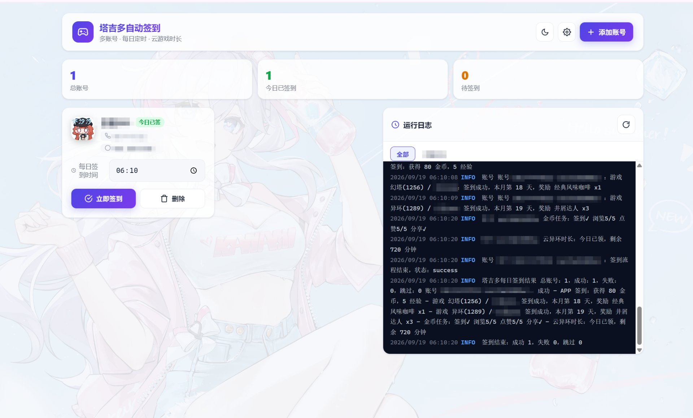
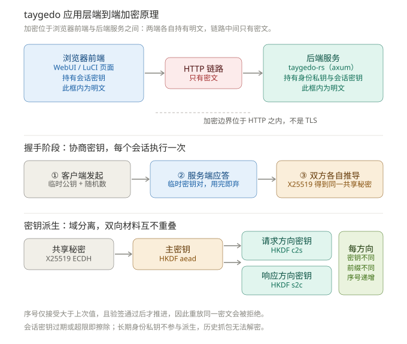

# 塔吉多自动签到 (Rust 版)

基于 Rust 重写的塔吉多（幻塔 / 异环等）每日自动签到工具，主打**简单易用、零门槛**：下载一个文件、双击运行，剩下的全部在一个现代化、**带登录鉴权**、**手机/PC 自适应**的 WebUI 图形界面里点点鼠标完成 —— 不需要命令行参数、不需要编辑配置文件、不懂技术也能上手，并支持 **OpenWrt 主线**集成（含 LuCI）。

**并且是端到端加密的**：WebUI / LuCI 与后端之间的请求与响应正文走 **X25519 + HKDF-SHA256 + AES-256-GCM** 应用层加密通道，即使有人在同一网络里抓包，也拿不到你的登录口令、Token 与账号数据。详见[应用层加密](#应用层加密)（含原理图）。

> 📦 各平台安装包见 [Releases](https://github.com/LianXia233/taygedo-CI/releases)
>
> Releases 分两条轨道：**正式版**（tag 形如 `v0.4.11`，稳定、推荐生产使用）与 **`nightly`**（滚动预发布，每次手动构建覆盖更新，仅供尝鲜）。日常使用请选正式版，或直接访问 [Latest Release](https://github.com/LianXia233/taygedo-CI/releases/latest)。

> 上游参考：[zzstar101/taygedo-auto-attendance](https://github.com/zzstar101/taygedo-auto-attendance)（TypeScript 版，**MIT 许可**）。本版将其核心逻辑用 Rust 重写，上游的 MIT 版权与许可声明保留在 [`src/upstream/`](./src/upstream/)；本项目自身代码以 **GPL-3.0** 发布，详见文末[许可证](#许可证)。

---

## 三步上手（零门槛）

全程只需要浏览器操作：添加账号、设置签到时间、看日志、改配置，都在 WebUI 界面里完成。

| 步骤 | Windows | Debian / Ubuntu | OpenWrt |
| --- | --- | --- | --- |
| ① 下载 | 到 [Releases](https://github.com/LianXia233/taygedo-CI/releases) 下载 zip 并解压 | 下载 `.deb` | 下载对应架构的 `.ipk` / `.apk` |
| ② 运行 | **双击 `taygedo-rs.exe`**（自动打开浏览器） | `sudo dpkg -i taygedo-rs_*.deb && sudo systemctl enable --now taygedo-rs` | `opkg install` / `apk add` 安装后自动注册开机自启并启动服务（0.4.12 起）；若服务未运行，执行 `/etc/init.d/taygedo enable && /etc/init.d/taygedo start` |
| ③ 使用 | 浏览器打开 `http://127.0.0.1:8787`，用**首次启动生成的随机初始口令**登录（见下方说明），点「添加账号」即可 | 同左（把地址换成服务器 IP） | LuCI 页面直接管理 |

> **关于初始口令**：0.5.0 起不再使用固定的 `admin/admin`。首次启动会生成一个高强度随机口令，**只在启动横幅（控制台 / 日志）打印一次**，登录后请立即在「设置」中修改。这样即使把服务暴露到公网，也不存在"默认弱口令"这一现成的攻破口。

> **关于加密**：加密是**默认开启**的（`crypto_policy=auto`）。内网访问走明文直通以省 CPU，一旦来源不在内网白名单内就自动强制加密 —— 你不需要做任何配置，它自己会判断。

就这么多 —— 之后每天会在你设定的时间自动签到，无需任何人工干预；手机浏览器同样可以打开管理界面。

---

## 功能特性

- **开箱即用，零门槛**：单文件程序，解压即用；所有功能都有图形界面，无需配置文件、无需命令行知识。
- **多账号**：任意数量的游戏账号，各自独立登录态。
- **两种登录方式**：
  - 密码登录（密码用 `scrypt + AES-256-GCM` 加密后落盘，与上游格式兼容）。
  - 短信验证码登录（WebUI 一键「发送验证码」→ 输入 → 登录）。
- **每日定时签到**：每个账号可单独设置每天的签到时间（`HH:MM`），也可设置全局默认时间。调度器固定使用**北京时间（UTC+8）**，与设备系统时区无关 —— Windows / Linux / OpenWrt 各平台行为完全一致；若进程在设定时间之后才启动（开机、重启），会自动**补签**，不会错过当天任务；每账号每天只触发一次，已签到的账号自动跳过，不会重复签到。
- **完整签到链路**：APP 签到、逐游戏签到（幻塔 1256 / 异环 1289 等，显示中文游戏名）、金币任务（签到/浏览/点赞/分享）、云异环时长。
- **幽灵角色修复**：优先使用战绩卡（`getGameRecordCards`）作为角色↔游戏权威映射，避免 `getGameRoles` 返回幽灵角色导致整账号 `code=5050` 失败。
- **会话自动续期**：`accessToken` 失效时自动 `refreshToken` → 失效再走 `laohuToken` 重建 → 有密码则密码重登。
- **登录鉴权**：WebUI 与所有 API 需要账号密码登录（**首次启动生成随机初始口令**，仅打印一次；**scrypt（N=16384, r=8, p=1）+ 恒定时间比对**哈希，旧 `sha256` 单轮哈希在首次登录时自动升级为 scrypt），token 有效期 7 天，支持在线修改登录账号与密码，改密后**已签发的全部 token 立即失效**。登录接口带失败限速（触发返回 429）。
- **免鉴权模式（可选）**：设置环境变量 `TAYGEDO_NO_AUTH=1`（OpenWrt 下在 UCI 配置 `option no_auth '1'`，**默认已开**）后，WebUI 与 LuCI 页面**无需登录**即可直接使用，适合内网自用场景。非内网来源即使开了该开关也不放行。
- **应用层端到端加密（0.5.0 新增，默认开启）**：WebUI / LuCI 与后端之间的**请求与响应正文**使用 **X25519 密钥交换 + HKDF-SHA256 + AES-256-GCM** 加密，具备**前向保密**、**防重放**、**AAD 绑定**、**密钥零化**。经实测，被动抓包时口令与 Token **出现 0 次**（明文对照组各出现 1 次）。抓包者只能看到密文，看不到你登录了什么、查了哪些账号。详见[应用层加密](#应用层加密)。
- **响应式界面**：手机 / PC 自适应布局，深浅色主题，背景壁纸（毛玻璃卡片）。
- **实时日志**：WebUI 内置带时间戳的详细运行日志。

## 界面



*WebUI 主界面预览：顶部统计（总账号 / 今日已签 / 待签到）、账号卡片与右侧带时间戳的实时运行日志。*

访问 `http://<host>:8787`，用**首次启动生成的随机初始口令**登录（程序启动时会在控制台/日志打印一次，并在 WebUI 顶部提示修改）：

- 顶部统计：总账号 / 今日已签 / 待签到。
- 账号卡片：自定义头像、**平台昵称**（无昵称时回退备注名）、每日签到时间（可改）、「立即签到」「删除」。
- 「添加账号」弹窗：密码 / 验证码两种登录。
- 「全局设置」：默认签到时间、金币任务、云时长开关、分享平台、修改密码、退出登录。
- 右侧实时运行日志。

---

## 安装教程

### 下载对应平台的安装包

| 平台 | 文件 | 说明 |
| --- | --- | --- |
| Windows (64 位) | `taygedo-rs-windows-x86_64.zip` | 单文件可执行程序 |
| Debian / Ubuntu (amd64) | `taygedo-rs_<版本>_amd64.deb` | 含 systemd 服务 |
| OpenWrt (x86_64 软路由) | `luci-app-taygedo_<版本>-1_x86_64.ipk` 或 `.apk` | 含 LuCI + 二进制 |
| OpenWrt (ARM64 路由器) | `luci-app-taygedo_<版本>-1_aarch64_cortex-a53.ipk` 或 `.apk` | 含 LuCI + 二进制 |
| Linux 静态 (musl) | `taygedo-rs-<arch>-unknown-linux-musl.tar.gz` | 其他 Linux/容器通用 |

> OpenWrt 24.10 及以上用 **apk** 包，23.05 及以下用 **ipk** 包（opkg）。

### Windows 安装

**1. 下载解压**

在 [Releases](https://github.com/LianXia233/taygedo-CI/releases) 下载 `taygedo-rs-windows-x86_64.zip`，解压得到 `taygedo-rs.exe`。

**2. 运行**

方式一（最简单）：双击 `taygedo-rs.exe`，弹出一个控制台窗口并启动服务。

方式二（推荐，便于自定义）：

```powershell
# 进入解压目录后运行
.\taygedo-rs.exe
```

可选环境变量：

```powershell
$env:TAYGEDO_LISTEN = "0.0.0.0:8787"        # 监听端口（默认 8787）
$env:TAYGEDO_DATA_DIR = "D:\taygedo-data"    # 数据目录（默认 .\data）
$env:TAYGEDO_WEB_PASSWORD = "你的密码"         # 初始登录密码（默认 admin）
.\taygedo-rs.exe
```

**3. 访问 WebUI**

浏览器打开 `http://127.0.0.1:8787`，用**首次启动生成的随机初始口令**登录（程序启动时会在控制台打印一次）。

**4. 开机自启（可选）**

- 任务计划程序：创建任务 → 触发器选「登录时」→ 操作填 `taygedo-rs.exe` 完整路径 → 勾选「使用最高权限运行」。
- 启动文件夹：把快捷方式放入 `Win + R` → `shell:startup` 目录。

**5. 防火墙放行（局域网访问用）**

```powershell
netsh advfirewall firewall add rule name="taygedo" dir=in action=allow protocol=TCP localport=8787
```

### Debian 安装

**1. 下载安装**

```bash
# 到 Releases 页面下载最新 deb（文件名带版本号，如 taygedo-rs_0.4.11_amd64.deb）
# https://github.com/LianXia233/taygedo-CI/releases/latest
sudo dpkg -i taygedo-rs_<版本>_amd64.deb
sudo apt-get install -f    # 若有依赖缺失（本项目基本无依赖，通常不需要）
```

**2. 启动并设置开机自启**

```bash
sudo systemctl enable --now taygedo-rs
sudo systemctl status taygedo-rs
```

**3. 自定义配置**

```bash
sudo systemctl edit taygedo-rs
```

在弹出内容中覆盖环境变量：

```ini
[Service]
Environment=TAYGEDO_LISTEN=0.0.0.0:8787
Environment=TAYGEDO_DATA_DIR=/var/lib/taygedo
Environment=TAYGEDO_WEB_PASSWORD=你的初始密码
```

保存后：

```bash
sudo systemctl daemon-reload
sudo systemctl restart taygedo-rs
```

**4. 访问与日志**

浏览器打开 `http://<服务器IP>:8787`，用**首次启动生成的随机初始口令**登录（见 `journalctl` 输出的启动横幅）。

```bash
sudo journalctl -u taygedo-rs -f
```

数据默认存储在 `/var/lib/taygedo`（`accounts.json` / `config.json` / `state.json`）。

### OpenWrt 安装

**1. 确定包格式与架构**

| OpenWrt 版本 | 包管理器 | 文件 |
| --- | --- | --- |
| 24.10 及以上 | `apk` | `*.apk` |
| 23.05 及以下 | `opkg` | `*.ipk` |

| 设备/平台 | 架构 | 文件名 |
| --- | --- | --- |
| x86_64 软路由 / 虚拟机 | x86_64 | `..._x86_64.ipk/apk` |
| ARM64 路由（MT7986/Rockchip 等） | aarch64_cortex-a53 | `..._aarch64_cortex-a53.ipk/apk` |

**2. 安装**

```sh
# opkg（23.05 及以下），文件名带版本号，如 luci-app-taygedo_0.4.8-1_x86_64.ipk
opkg install /tmp/luci-app-taygedo_<版本>-1_x86_64.ipk

# apk（24.10 及以上），如 luci-app-taygedo_0.4.12-r1_x86_64.apk
apk add /tmp/luci-app-taygedo_<版本>-r1_x86_64.apk
```

**3. LuCI 页面**

浏览器打开路由器 LuCI → **服务 → 塔吉多签到**，单页即完整管理界面（账号卡片 / 统计 / 运行日志 / 添加账号 / 全局设置），与 WebUI 功能、视觉保持同步。

> **安装即用，无需手动操作**：`apk`/`opkg` 的安装脚本（`post-install` / `postinst`）会**自动**
> `enable` 并启动服务，且包内 `/etc/config/taygedo` 默认 `enabled '1'` + `no_auth '1'`。
> 因此装包完成后打开 LuCI 页面即可直接管理账号，无需执行任何额外命令。
> 若曾用 `uci set taygedo.main.enabled=0` 显式停用，安装脚本不会强行启动（尊重用户选择）。

- **免鉴权模式**（UCI 默认 `option no_auth '1'`，**OpenWrt 专享**）：LuCI 页面免登录直连后端 API，直接管理账号。
- **未开免鉴权**：页面显示引导页，点右上「**外部 WebUI**」按钮跳转 `:8787` 独立管理界面（或在路由器执行 `uci set taygedo.main.no_auth=1 && uci commit taygedo && /etc/init.d/taygedo restart` 开启免鉴权）。
- **职责划分（LuCI 与 WebUI 解耦）**：UCI（`/etc/config/taygedo`）只管理**服务级**配置（启用 / 监听端口 / 数据目录 / Web 登录密码 / 免鉴权开关）；**业务级**配置（默认签到时间 / 金币任务 / 云时长 / 分享平台）统一由 `config.json` 管理，LuCI 页面与独立 WebUI 均通过「全局设置」读写同一份数据，二者**数据互通、相互独立、互不影响**——重启服务不会用 UCI 旧值覆盖 WebUI 的修改。

**免鉴权模式的影响范围（务必了解）**

| 维度 | 说明 |
| --- | --- |
| 生效范围 | 仅作用于 `/api/*` REST 接口，**不改动 LuCI 自身**的登录鉴权与 ACL |
| 放行条件 | 需同时满足 `no_auth=1` **且**来源 IP 命中 `lan_cidrs`；非内网来源**不放行**（`lan_no_auth` 控制） |
| 网络层 | 仅建议在可信局域网启用；若服务端口已映射到公网，请保持 `no_auth=0` |
| 加密层 | 与 `crypto_policy` 独立，`auto` 下内网仍明文直通，非内网仍强制加密 |

**如何开关**

```sh
# 开启（LuCI 页面据此免登录直连）
uci set taygedo.main.no_auth=1 && uci commit taygedo && /etc/init.d/taygedo restart

# 关闭（改回登录模式，LuCI 页面显示引导页跳转独立 WebUI）
uci set taygedo.main.no_auth=0 && uci commit taygedo && /etc/init.d/taygedo restart

# 查看当前状态
uci get taygedo.main.no_auth
```

**4. 打开 WebUI**

LuCI 页面右上「**外部 WebUI**」按钮，或浏览器直接访问 `http://<路由器IP>:8787`。免鉴权模式直接进入；未开启时用**本次生成的随机初始口令**登录（见下）。

> **初始口令不再固定为 `admin/admin`**：0.5.0 起首次启动会用 CSPRNG 生成高强度随机口令，
> 仅打印在服务启动横幅（stdout）中一次，可通过 `logread | grep -A5 taygedo | head -20`
> 或 `/etc/init.d/taygedo restart` 后查看。登录后请在「设置」中立即修改，改密后所有会话失效。

**5. 命令行管理（可选）**

```sh
# 服务级配置（UCI）
uci set taygedo.main.enabled=1
uci set taygedo.main.port=8787
uci commit taygedo

# 业务级配置（默认签到时间 / 金币任务 / 云时长 / 分享平台）
# 在 LuCI 页面或 WebUI 的「全局设置」中修改，统一写入 config.json，无需操作 UCI

/etc/init.d/taygedo start|stop|restart|status
logread | grep taygedo
```

---

## 通用使用指南

**登录**：0.5.0 起首次启动生成**随机初始口令**（不再是固定 `admin/admin`），仅打印在启动横幅一次；
登录后请在「设置」中修改账号与口令（口令长度 ≥ 8），改密后所有会话立即失效需重新登录。

**添加账号**：
- 密码登录：输入手机号 + 密码。
- 验证码登录：输入手机号 → 点「发送验证码」→ 输入短信验证码。

**每日签到时间**：全局默认在「设置」；单账号在账号卡片上直接修改。

**手动签到**：账号卡片点「立即签到」。

**多账号**：重复「添加账号」，每个账号独立登录态与签到时间。

---

## 从源码构建

### Docker（推荐）

```bash
docker compose up -d --build
```

运行后访问 `http://localhost:8787`，数据持久化在 `./data`。

### 本机 cargo

需要 Rust 工具链（stable 即可）。

```bash
cargo run --release
```

环境变量：

| 变量 | 默认值 | 说明 |
| --- | --- | --- |
| `TAYGEDO_LISTEN` | `0.0.0.0:8787` | 监听地址 |
| `TAYGEDO_DATA_DIR` | `data` | 数据目录 |
| `TAYGEDO_WEB_PASSWORD` | `admin` | WebUI 初始登录密码（账号默认 `admin`） |
| `TAYGEDO_DEFAULT_SCHEDULE` | 无 | 覆盖默认签到时间 |
| `TAYGEDO_COIN_TASKS` | 无 | 覆盖金币任务开关（true/false） |
| `TAYGEDO_CLOUD_DURATION` | 无 | 覆盖云时长开关（true/false） |
| `TAYGEDO_SHARE_PLATFORM` | 无 | 覆盖分享平台 |
| `TAYGEDO_NO_AUTH` | `false` | 免鉴权模式（`1/true/yes/on` 开启），WebUI 与 API 无需登录 |

### Windows 编译

```bash
rustup toolchain install stable-x86_64-pc-windows-gnu
cargo +stable-x86_64-pc-windows-gnu build --release
```

---

## 多平台 / 多架构

使用 musl 静态链接。`.github/workflows/build.yml` 打 tag 或手动触发即自动交叉编译并发布以下架构：

| OpenWrt 架构 | Rust target | 说明 |
| --- | --- | --- |
| x86_64 | `x86_64-unknown-linux-musl` | 软路由 / 虚拟机 |
| aarch64 (cortex-a53) | `aarch64-unknown-linux-musl` | Rockchip、MT7986 等新平台 |

---

## OpenWrt / LuCI 集成（开发者）

`openwrt/luci-app-taygedo/` 提供完整 LuCI 包，安装后可在 **LuCI → 服务 → 塔吉多签到** 里：

- **功能与 WebUI 一致**：账号管理、密码/短信验证码登录、每日签到时间、立即签到、运行日志、全局设置（免鉴权模式下隐藏改密）。
- **与 WebUI 解耦**：LuCI 页面不维护后端登录态/token，直连后端 REST API（依赖免鉴权模式，UCI 默认 `no_auth '1'`）；未开免鉴权时显示引导页并提供「外部 WebUI」跳转。
- **服务级配置**（UCI `config taygedo`）：启用开关、监听端口、数据目录、Web 登录密码、免鉴权开关。
- **业务级配置**（默认签到时间、金币任务、云时长、分享平台）：统一由 `config.json` 管理，LuCI 页面与独立 WebUI 通过 `/api/config` 读写同一份数据，数据互通、互不覆盖。
- init.d 脚本（procd）自动拉起/守护 `taygedo-rs`，支持 reload。

```
openwrt/luci-app-taygedo/
├── Makefile                       # 包定义（默认预编译下载，源码编译见注释）
├── htdocs/
│   └── luci-static/resources/view/taygedo/
│       └── status.js              # 现代 LuCI JS 前端（功能对齐 WebUI）
└── root/
    ├── etc/config/taygedo         # UCI 默认配置
    ├── etc/init.d/taygedo         # procd 守护脚本
    └── usr/share/
        ├── luci/menu.d/taygedo.json
        └── rpcd/acl.d/luci-app-taygedo.json
```

使用：把该目录放到 `package/` 或 feeds 中，`make menuconfig` 勾选 `LuCI → Applications → luci-app-taygedo` 后编译。

---

## 应用层加密

**加密位于「浏览器前端」与「后端服务」之间——两端各自持有明文，链路中间只有密文。**



*上方：加密边界所在位置。下方：握手阶段协商密钥的过程，以及双向密钥的域分离派生关系。*

它**不是 TLS/HTTPS**，而是叠加在 HTTP 之上的应用层加密：HTTP 头（请求路径、方法）仍是明文，
但**请求与响应正文**（口令、Token、账号数据）已不可读。若部署环境能终止 TLS，仍应优先用 TLS——
两者不冲突，本方案是 HTTPS 不可用时的等价兜底（自签名证书在浏览器端体验差，自编译固件也不便申请公网证书）。

### 目标与威胁模型

**目标**：攻击者在内网或公网链路上做**被动抓包**（tcpdump / 镜像口 / 交换机 SPAN），
无法还原任意请求或响应正文，包括登录口令、`Authorization` Token、账号数据与签到结果。

**不在范围内**：终端被控（浏览器被注入脚本）、服务端被拿到 root、以及**设备本机的主动中间人**。
这与 HTTPS 的威胁边界一致——本方案不防"端点被拿下"，只防"链路被看"。

### 密码学方案

| 环节 | 算法 / 参数 | 说明 |
| --- | --- | --- |
| 密钥交换 | X25519 ECDH | 每次握手服务端生成**临时密钥对**（前向保密），长期身份密钥不参与派生 |
| 密钥派生 | HKDF-SHA256 | salt = `client_pub \|\| server_pub \|\| client_nonce \|\| server_nonce` |
| 会话密钥 | AES-256-GCM | 双向独立派生：`taygedo/v1/c2s`、`taygedo/v1/s2c` |
| Nonce 构造 | 4 字节 HKDF 前缀 + 8 字节大端计数器 | 前缀由会话密钥派生，跨会话不重复 |
| AAD | `sid \|\| direction(1B) \|\| seq(8B)` | 响应额外绑定 `reqSeq(8B)`，防止响应重排/错配 |
| 防重放 | 每方向单调递增 `seq` | 仅接受 `seq > last_seq`，且**验签通过后**才推进计数 |
| 密钥销毁 | `zeroize` | 会话过期（30 分钟）或请求数超限（20 万次）即销毁并擦除 |

**为什么选它**：X25519 在 aarch64 cortex-a53 上单次约 50 μs 量级，HKDF 与 AES-GCM 均
可走硬件加速（ARMv8 有 AES/PMULL 指令）。相比 ChaCha20-Poly1305，二者安全强度等价，
但 AES-GCM 在支持 AES 指令的 ARM64 路由器上吞吐更高；在不支持 AES 加速的老旧 MIPS 上，
ChaCha20-Poly1305 反而更快，**但它同时失去硬件卸载优势且改动面更大**，故未采用。
非对称部分没有更省的替代 —— 任何要先协商密钥的方案都绕不开一次 ECDH。

> **aarch64 必须显式开启硬件 AES**：`aes` crate 的 `aes_armv8` 是**编译期 cfg 门控**，
> 不开启时 aarch64 目标会静默落到 `soft` 后端 —— 性能相差约一个数量级，且软件查表
> 实现存在 cache-timing 侧信道风险。本项目已在 `.cargo/config.toml` 为
> `aarch64-unknown-linux-musl` / `-gnu` 加入 `rustflags = ["--cfg", "aes_armv8"]`，
> 运行时自动探测 CPU 特性（`armv8 + autodetect`），在不支持扩展的旧 CPU 上回落而非崩溃。
> 自行为本项目交叉编译 aarch64 时请保留该配置。注意 `[target.<triple>.rustflags]`
> 会**覆盖**环境变量 `RUSTFLAGS` 而非追加。

**上线后的实测**：单次握手在毫秒级（aarch64 路由实测约数十毫秒量级，受设备负载影响）。
加解密本身的开销远小于一次 HTTP 往返，未观察到对页面交互的可感知影响。

### `crypto_policy`：何时强制加密

OpenWrt / 内网场景若一刀切强制加密，会破坏免鉴权直连的便利性。因此引入策略开关：

| 取值 | 行为 | 适用场景 |
| --- | --- | --- |
| `auto`（默认） | **内网明文直通，非内网强制加密** | 推荐。家里局域网点点用，公网暴露时自动加密 |
| `always` | 所有请求必须加密，未加密请求返回 `428 Precondition Required` | 需要满足等保/合规，或链路不可信 |
| `never` | 从不下发加密要求（客户端可自行选择加密） | 排障兜底 |

**内网判定**由 `lan_cidrs` 决定，默认值：

```
10.0.0.0/8, 172.16.0.0/12, 192.168.0.0/16, 127.0.0.0/8,
169.254.0.0/16, ::1/128, fc00::/7, fe80::/10
```

判定基于 `ConnectInfo<SocketAddr>` 的**真实对端 IP**，不信任任何 `X-Forwarded-For`
（否则伪造该头即可自证是内网）。判定同时做 IPv4-mapped IPv6 归一化（`::ffff:192.168.1.5` 按 IPv4 处理）。

> `lan_cidrs` 允许为空。留空时会**回落到上述默认值**，而不是变成空集合 ——
> 避免用户清空字段后既不放行任何内网、又无法恢复。

### 免鉴权与加密的交互

| 组合 | 结果 |
| --- | --- |
| `no_auth=1` + 内网访问 | 完全放行，加密走 `auto` 的明文分支，前端可用性不变 |
| `no_auth=1` + 非内网访问 | 仍然免登录，但**正文被强制加密**（`auto` 的非内网分支），抓包读不到内容 |
| `no_auth=0` | 正常登录流程 + `auto` 加密策略；LuCI 自身的登录鉴权与 ACL 链完全不受影响 |

LuCI 页面走的是 `rpcd`/`ubus` 调用 + `luci-app-taygedo` 自带 ACL，加密层只作用于
`/api/*` 的 HTTP 通道，**不触碰 LuCI 的鉴权链**。

### 密钥管理

- **生成**：首次启动时用 CSPRNG 生成 32 字节身份密钥写入 `data/keyring.json`，**代码中无任何硬编码密钥**。
- **存储**：Unix 下文件 `0600`、数据目录 `0700`；Windows 下依赖用户目录 ACL。
  启动时若检测到权限过宽会打印告警（不阻断启动，避免误伤容器场景）。
- **备份**：把 `data/keyring.json` 与浏览器侧的信任记录一起备份即可。
  丢失该文件不影响可用性（客户端会提示身份变化并重新信任），但会失去身份连续性。
- **轮换**：删除 `keyring.json` 后重启即生成新身份，所有旧会话立即失效。
- **不参与派生**：身份密钥**只用于客户端校验服务端身份**，会话密钥完全来自当次握手的临时密钥对 ——
  即使身份密钥泄露，历史抓包也无法被解密（前向保密）。
- **升级保留**：`keyring.json` 位于数据目录（OpenWrt 下为 `/etc/taygedo/`），
  `luci-app-taygedo` 已把它所在的 `/etc/config/taygedo` 声明为 `conffiles`，
  `opkg`/`apk` 升级不会覆盖用户配置与密钥。

### 改动文件与配置项

**代码**

| 文件 | 改动 |
| --- | --- |
| `src/session.rs` | 新增。加密会话管理、握手、加解密、防重放 |
| `src/protocol.rs` | 新增 X25519 / HKDF / 常量时间比较原语 |
| `src/crypto.rs` | 口令哈希升级为 scrypt v2，保留 v1 校验以支持自动迁移 |
| `src/web.rs` | 加密中间件、握手接口、CORS 同源白名单、移除去 Cookie 取 token、锁定策略、`/api/logout`、`/api/meta` |
| `src/service.rs` | `CryptoManager`、`LanMatcher`（支持运行时热更新）、环境变量覆盖 |
| `src/store.rs` | `keyring.json` 读写与权限加固 |
| `src/models.rs` | `Config` 新增 `crypto_policy` / `lan_no_auth` / `lan_cidrs` / `web_password_version` 等字段 |
| `static/taygedo-crypto.js` | 新增。浏览器端 WebCrypto 加密客户端 |
| `docs/images/crypto-architecture.svg` | 新增。本文档的原理图 |
| `src/ui.html` | 设置面板新增加密策略、内网白名单、免鉴权开关；改密支持改账号 |
| `openwrt/.../status.js` | LuCI 页面同步支持上述配置与改密 |

**配置项（`config.json` / UCI）**

| 键 | 默认 | 说明 |
| --- | --- | --- |
| `crypto_policy` | `auto` | `auto` / `always` / `never` |
| `lan_cidrs` | 空（回落默认值） | 内网网段白名单，逗号分隔 |
| `lan_no_auth` | `1` | 内网免登录开关 |
| `web_password_version` | 自动写入 | `2` 表示 scrypt v2 |

对应环境变量：`TAYGEDO_CRYPTO_POLICY`、`TAYGEDO_LAN_CIDRS`、`TAYGEDO_LAN_NO_AUTH`、
`TAYGEDO_NO_AUTH`、`TAYGEDO_ALLOWED_ORIGINS`（CORS 额外白名单）。

### 向后兼容与回滚

**兼容**：老客户端（不含加密前端）访问 `auto` 策略下的内网地址仍可正常工作；
`always` 策略下老客户端会收到 `428`，需要更新前端资源或把策略临时改为 `never`。

> **运维提示**：`always` 策略下**没有明文回退通道** —— 一旦前端资源损坏或浏览器不兼容，
> 将无法通过页面把策略改回 `auto`，只能 SSH 改 UCI 并重启服务。请在确认链路可信、
> 且已准备好 SSH 兜底手段后再启用 `always`。

**策略切换的已知陷阱（0.5.0 已修复）**：修改 `crypto_policy` 时服务端需要作废既有加密
会话以强制重新握手。早期实现会把**发起本次请求的会话一并销毁**，导致配置实际已生效、
但响应无法加密返回而报 `428`/无会话错误，表现为「操作成功却提示失败」。现改为策略变更
时保留当前会话、仅作废其余会话；且只有走加密通道才需要保留（明文通道下等价于全部作废）。

**回滚**（无需重装，三步）：

1. UCI 设置 `option crypto_policy 'never'`，或环境变量 `TAYGEDO_CRYPTO_POLICY=never`，
   然后 `/etc/init.d/taygedo restart` —— 立即恢复明文通道。
2. 若需回到 0.4.x 二进制：直接覆盖回旧版可执行文件，配置与数据格式向下兼容
   （`crypto_policy` 等新字段旧版会忽略）。
3. OpenWrt 备份还原：`/root/taygedo-backup-<日期>.tar.gz` 中含旧二进制、旧 `status.js`
   与配置，解包覆盖后重启服务即可。

### 验证清单

下表为 0.5.0 在**真实设备**（ImmortalWrt SNAPSHOT / mediatek filogic / aarch64_cortex-a53）
与 Debian 云服务器上的实测结果，同时可作为部署后的自检清单。

| 项 | 方法 | 预期 | 实测 |
| --- | --- | --- | --- |
| 正文不可读 | `tcpdump -i any -A -s0 port 8787` 抓包后 grep 口令 | 加密通道下口令出现 0 次 | 通过（口令 0 次、Token 0 次、`username` 字样 0 次） |
| 对照组 | 用 `crypto_policy=never` 复现同一操作 | 明文口令应出现，证明抓包本身有效 | 通过（口令与 Token 各 1 次） |
| 内网免鉴权 | 从 `192.168.x.x` 不登录取 `/api/accounts` | 200 且正文为明文 | 通过 |
| 非内网强制加密 | 用公网 IP 或伪造的 `lan_cidrs` 之后访问 | 明文请求返回 428 | 通过（白名单收窄后本机 IP 收 428 + `x-tgd-enc: 0`） |
| 免鉴权模式 | `no_auth=1` 后直连 WebUI / LuCI | 无需登录即可用 | 通过 |
| LuCI 独立管理账号 | 内网 + `no_auth=1` + 无 token 下操作 LuCI 页面 | 列账号/读配置/读日志/改签到时间均生效 | 通过（全部 200，改动已写盘） |
| LuCI 不受影响 | 登录 LuCI 操作页面 | 页面、ACL、ubus 调用均正常 | 通过 |
| 改密后 | 改账号与口令，用新凭据登录，旧 token 访问 | 新凭据可登录；旧 token 返回 401 | 通过 |
| 旧哈希升级 | 用 0.4.x 的 `config.json` 启动后登录一次 | `web_password_version` 变为 2，哈希前缀为 scrypt | 通过（v1→v2，salt 8→16 字节，原口令无感登录） |
| 防重放 | 重发同一密文请求 | 返回 400（Replay） | 通过 |
| 策略热切换 | 加密通道下把 `always` 改回 `auto` | 配置生效且**响应不报错** | 通过（修复前报 428，见下） |
| 升级无损 | 升级前后比对数据文件 md5 | 账号与状态文件完全一致 | 通过（`accounts.json`/`state.json` md5 相同） |
| 密钥权限 | `ls -l /etc/taygedo/` | `keyring.json` 为 `0600`、目录 `0700` | 通过（首次启动自动生成） |
| E2E 协议测试 | 独立协议客户端跑全流程 | 全项通过 | 通过（17/17） |

---

## 数据与兼容性

- `data/accounts.json`：账号列表，字段与上游 `accounts.json` 完全兼容。可直接把上游已登录的账号文件复制过来复用（`refreshToken` / `laohuToken` 会自动续期）。
- `data/config.json`：全局配置（凭据密钥、默认签到时间、各账号签到时间、开关、Web 账号密码哈希）。
- `data/state.json`：每日签到状态（按「账号 + 日期」去重，避免重复签到）。
- `data/keyring.json`（0.5.0 新增）：应用层加密的**服务端长期身份密钥**（32 字节随机数，首次启动自动生成）。
  文件权限为 `0600`（目录 `0700`），**不参与**会话密钥派生，仅用于客户端校验服务端身份，防止中间人替换。
  升级安装不会覆盖该文件；卸载/重装如需保留身份，请把它一并备份。

> **升级兼容性**：0.4.x 的 `config.json` 可直接被 0.5.0 读取。旧的单轮 `sha256` 口令哈希
> （8 字符 salt、无 `web_password_version` 字段）在首次成功登录后会**自动原地升级**为 scrypt v2，
> 用户无感知、不需要重置口令。`accounts.json` / `state.json` 格式未变。

---

## API 一览

除 `/api/login`、`/api/crypto/handshake` 外，所有 API 需携带 `Authorization: Bearer <token>`。

> 0.5.0 起**不再接受 Cookie 传递 token**（审计发现 P1-3：Cookie 分支会随 CORS 配置被跨站利用），只认 `Authorization` 头；跨站请求默认被同源 CORS 白名单拦截。

| 方法 | 路径 | 说明 |
| --- | --- | --- |
| POST | `/api/crypto/handshake` | 加密信道握手（未鉴权，仅交换公钥并下发会话标识） |
| POST | `/api/login` | 登录 `{username, password}` → `{token}`（锁定策略：60 秒内 5 次失败后返回 429） |
| POST | `/api/password` | 修改登录账号/密码 `{old_password, new_password, new_username?}`（身份取自服务端会话，忽略请求体中的 `username`） |
| POST | `/api/logout` | 注销当前 token 并销毁对应加密会话 |
| GET | `/api/meta` | 读取运行模式标记（是否免鉴权、是否需要加密、是否必须改口令） |
| GET | `/api/accounts` | 账号列表（敏感字段已脱敏） |
| POST | `/api/accounts` | 登录账号 `{phone, mode, password?, captcha?, name?}` |
| DELETE | `/api/accounts/{id}` | 删除账号 |
| POST | `/api/accounts/{id}/signin` | 手动签到 `{force?}` |
| POST | `/api/accounts/{id}/schedule` | 设置签到时间 `{time:"HH:MM"}` |
| POST | `/api/send-code` | 发送短信验证码 `{phone}` |
| GET/POST | `/api/config` | 读取 / 更新全局配置 |
| GET | `/api/logs?limit=200` | 运行日志 |

---

## 目录结构

```
src/
├── main.rs        # 入口：启动服务 + 定时调度
├── api.rs         # 塔吉多/老虎 API 客户端（签名、加密、请求）
├── protocol.rs    # MD5 签名、AES-128-ECB、ds 校验、表单编码
├── runner.rs      # 签到核心逻辑
├── crypto.rs      # scrypt + AES-256-GCM 凭据加密、登录密码哈希
├── service.rs     # 应用状态、鉴权会话、业务编排
├── scheduler.rs   # 每日定时调度
├── login.rs       # 设备身份 / 账号 id 生成
├── models.rs      # 数据模型
├── store.rs       # 文件存储
├── session.rs     # 应用层加密：X25519 握手 / HKDF / AES-256-GCM / 防重放
├── web.rs         # HTTP 路由 + 鉴权中间件 + 加密中间件 + 处理器
└── ui.html        # WebUI（自包含单文件，响应式）
static/
└── taygedo-crypto.js  # 浏览器端加密客户端（WebCrypto，前端引用同一套协议）
openwrt/luci-app-taygedo/   # OpenWrt / LuCI 集成
.github/workflows/build.yml # 多架构交叉编译 CI
scripts/package.sh          # deb / ipk / apk 打包脚本
```

---

## 更新日志 (Changelog)

完整的版本变更记录已迁移至独立文件 [CHANGELOG.md](./CHANGELOG.md)，本文件不再内嵌更新日志。

## 常见问题

**Q：访问 WebUI 提示无法连接？**
检查服务是否运行、端口是否被防火墙/安全组拦截、监听地址是否为 `0.0.0.0`。

**Q：忘记 WebUI 密码？**
删除数据目录下的 `config.json`（或其中的 `web_username` / `web_password_hash` / `web_password_salt` / `web_password_version` 字段）后重启，程序会**重新生成一个随机初始口令**并打印在启动横幅中——不再是固定的 `admin/admin`。请留意控制台或 `journalctl -u taygedo-rs` / `logread | grep taygedo` 的输出。

**Q：签到失败 / 登录态失效？**
在 WebUI 中删除该账号并重新登录即可。

**Q：OpenWrt 上如何更新？**
下载新版本对应架构的包，用 `opkg install` / `apk add` 覆盖安装。
`/etc/config/taygedo` 与 `/etc/taygedo/`（含 `keyring.json`）不会被覆盖。

**Q：抓包看到乱码，是坏了吗？**
不是。这是应用层加密生效的正常表现。客户端会自动完成握手与解密，WebUI 使用不受影响。

**Q：升级后浏览器提示「服务端身份已变化」？**
说明 `keyring.json` 被删除或替换（例如重装、清空了 `/etc/taygedo/`）。
确认是你自己的操作后重新信任即可；若非本人操作，请检查设备是否被他人控制。

**Q：想让局域网也强制加密怎么办？**
把 `crypto_policy` 设为 `always`，或清空 `lan_cidrs`（清空会回落默认内网段，不会放行全部）。
若要连内网也走加密，请把 `lan_cidrs` 设为 `127.0.0.1/32` 之类的窄网段。

**Q：手机能访问吗？**
能，WebUI 已适配手机浏览器。

---

## 免责声明

本项目仅供学习与个人自用，请遵守相关平台的服务条款。使用本工具产生的任何后果由使用者自行承担。


---

## 许可证

| 范围 | 许可证 | 位置 |
| :--- | :--- | :--- |
| 本项目 Rust 实现、WebUI 与 OpenWrt / LuCI 集成 | **GPL-3.0** | 根目录 [`LICENSE`](./LICENSE) |
| 上游 TypeScript 实现（逻辑参考来源） | **MIT** | [`src/upstream/LICENSE-MIT`](./src/upstream/LICENSE-MIT)，Copyright (c) 2026 zzstar101 |

- 本项目为上游 [zzstar101/taygedo-auto-attendance](https://github.com/zzstar101/taygedo-auto-attendance)（MIT）的 Rust 重写版本，新增与改写的代码整体以 **GPL-3.0** 授权。
- 上游是宽松的 MIT 许可，允许其代码被并入 GPL 项目，因此两层许可可以并存：上游归属与 MIT 声明完整保留，不因本项目改用 GPL 而改变。
- 选择 GPL-3.0 而非 GPL-2.0，是为了与 Rust 生态常见依赖（reqwest、serde、chrono 等的 `MIT OR Apache-2.0` 双许可）保持兼容 —— GPL-2.0 与 Apache-2.0 条款不兼容，GPL-3.0 则明确允许 Apache-2.0 代码并入。
- 若你只使用上游的原始 TypeScript 版本，请以该项目的 MIT 许可为准；使用本项目（Rust 版）及其衍生代码时，需遵循 GPL-3.0。
